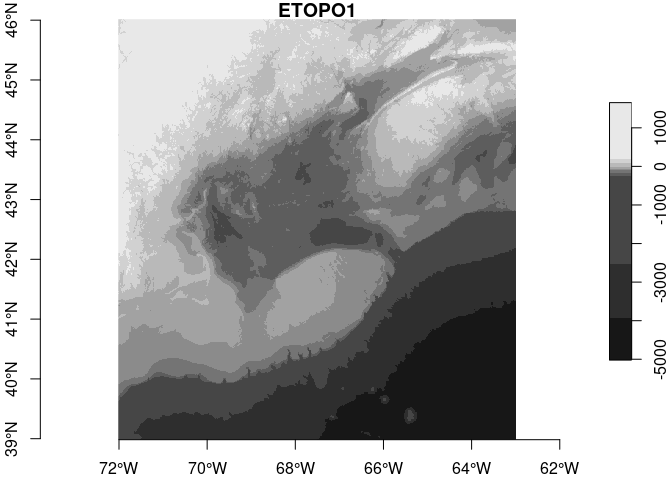
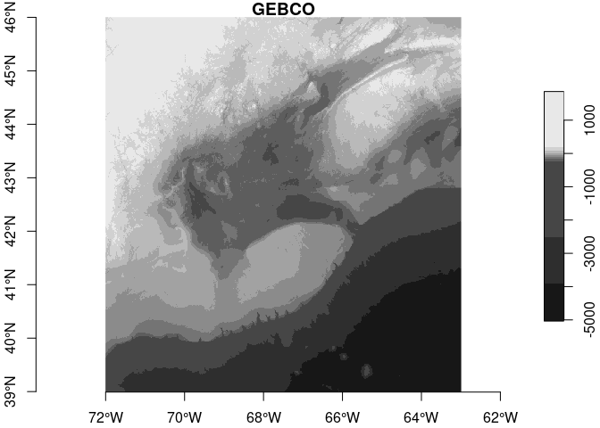
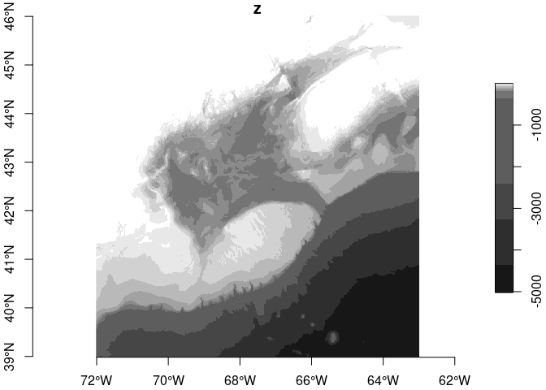

topotools
================

Coding tools for working with local copies of [ETOPO
data](https://www.ncei.noaa.gov/products/etopo-global-relief-model) and
[GEBCO
data](https://www.gebco.net/data_and_products/gridded_bathymetry_data/#global).

### ETOPO Citation

    NOAA National Centers for Environmental Information. 2022: ETOPO 2022 15 Arc-Second Global Relief Model. NOAA National Centers for Environmental Information. DOI: 10.25921/fd45-gt74. Accessed 2023-03-17.

### GEBCO Citation

    GEBCO Compilation Group (2022) GEBCO_2022 Grid (doi:10.5285/e0f0bb80-ab44-2739-e053-6c86abc0289c) Accessed 2023-03-17.

## Requirements

-   [terra](https://CRAN.R-project.org/package=terra)

-   [stars](https://CRAN.R-project.org/package=stars)

-   [sf](https://CRAN.R-project.org/package=sf)

-   [dplyr](https://CRAN.R-project.org/package=dplyr)

-   [ncdf4](https://CRAN.R-project.org/package=ncdf4)

## Installation

    devtools::install_github("BigelowLab/topotools")

## Usage

``` r
library(topotools)
library(stars)
```

### Paths

ETOPO and GEBCO datasets are very large. We suggest that you download
them to a directory for bathymetry/topography datasets. Then store the
path description to this directory in a hidden text file called
`~/.topodata` in your home directory. We can help with that. Let’s say
your path is `/mnt/s1/projects/ecocast/coredata/bathy`. Then just call
the `set_root_path()` function from the `topotools` package like this.

    set_root_path(path = "/mnt/s1/projects/ecocast/coredata/bathy", filename = "~/.topodata")

You don’t need to do this each time you use the package; just once
before your first use, and, of course, again if you move your data.

### The Data

Within this data directory create two subdirectories: `gebco` and
`etopo`.

Into the `gebco` directory store the “GEBCO_YYYY Grid (ice surface
elevation)” NetCDF file, where `YYYY` is obviously a 4 digit year. It
may download as a zipped file, but be sure to unzip it. You can find the
[GEBCO data
here](https://www.gebco.net/data_and_products/gridded_bathymetry_data/#global).

Into the `etopo` directory store either the 30 arc-second or 60
arc-second (or both!) NetCDF file. You can find [ETOPO data
here](https://www.ncei.noaa.gov/products/etopo-global-relief-model).

Now you are all set to use the package.

### Read in a region

While it is possible to read in the entire dataset for each source,
generally the practice is to read in a portion defined by a bounding box
specified in `[west, east, south, north]` order.

``` r
bb <- c( -72,  -63,   39,   46)
(etopo_files = list_etopo())
```

    ## [1] "ETOPO_2022_v1_30s_N90W180_surface.nc"
    ## [2] "ETOPO_2022_v1_60s_N90W180_surface.nc"

``` r
etopo <- read_etopo("ETOPO_2022_v1_60s_N90W180_surface.nc", bb = bb)
etopo
```

    ## stars object with 2 dimensions and 1 attribute
    ## attribute(s):
    ##         Min.   1st Qu.   Median      Mean  3rd Qu.     Max.
    ## z  -5021.792 -1730.825 -95.4375 -908.8038 38.10166 1653.262
    ## dimension(s):
    ##   from  to   offset      delta refsys x/y
    ## x    1 542 -72.0167  0.0166667 WGS 84 [x]
    ## y    1 422  46.0167 -0.0166667 WGS 84 [y]

``` r
(gebco_files = list_gebco())
```

    ## [1] "GEBCO_2022.nc"

``` r
gebco <- read_gebco("GEBCO_2022.nc", bb = bb)

gebco
```

    ## stars object with 2 dimensions and 1 attribute
    ## attribute(s), summary of first 1e+05 cells:
    ##    Min. 1st Qu. Median     Mean 3rd Qu. Max.
    ## z   -78      47    154 195.0478     326 1502
    ## dimension(s):
    ##   from   to   offset       delta                     refsys x/y
    ## x    1 2162 -72.0042  0.00416667 +proj=longlat +datum=WGS84 [x]
    ## y    1 1682  46.0042 -0.00416667 +proj=longlat +datum=WGS84 [y]

Note that the GEBCO data provides approximately 4x the resolution of the
ETOPO1 data.

For display purposes, it is helpful to clip each raster into a small
range of values.

``` r
plot(etopo, 
     main = "ETOPO1",
     axes = TRUE)
```

<!-- -->

``` r
plot(gebco, 
     main = "GEBCO", 
     axes = TRUE)
```

    ## downsample set to 2

<!-- -->

### Masking

The `mask_topo` function will work with either data set (well, any
`terra::SpatRaster` or `stars::stars` object.) It has optional
arguments, but at its simplest…

``` r
masked_etopo = mask_topo(etopo)
plot(masked_etopo, axes = TRUE)
```

<!-- -->
