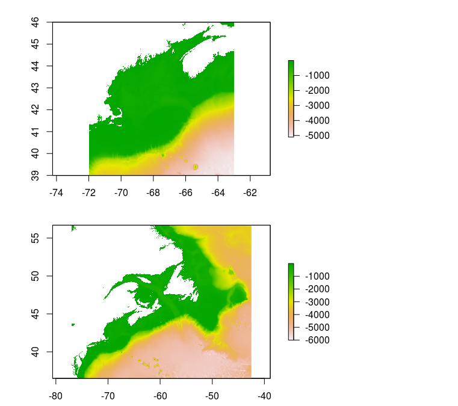

# [etopotools](https://github.com/BigelowLab/etopotools)

Coding tools for working with local copies of [ETOPO data](https://ngdc.noaa.gov/mgg/global/).

## Citation [doi:10.7289/V5C8276M](http://dx.doi.org/10.7289/V5C8276M)
```
Amante, C. and B.W. Eakins, 2009. ETOPO1 1 Arc-Minute Global Relief Model:
Procedures, Data Sources and Analysis. NOAA Technical Memorandum NESDIS NGDC-24.
National Geophysical Data Center, NOAA. doi:10.7289/V5C8276M [2018-11-01].
```

## Requirements

+ [raster](https://CRAN.R-project.org/package=raster)

## Installation

```
devtools::install_github("BigelowLab/etopotools")
```

## Usage

### Paths

```
library("etopotools")
dir(etopo_path(), full.names = TRUE)
```

### Bounding Box, Bathymetry and Mask

Read in the entire dataset.

```
(etopo <- read_etopo())
# class      : RasterLayer 
# dimensions : 10800, 21600, 233280000  (nrow, ncol, ncell)
# resolution : 0.01666667, 0.01666667  (x, y)
# extent     : -180, 180, -90, 90  (xmin, xmax, ymin, ymax)
# crs        : +proj=longlat +datum=WGS84 +ellps=WGS84 +towgs84=0,0,0 
# source     : /mnt/ecocast/coredata/bathy/ETOPO1/ETOPO1_Ice_c_geotiff.tif 
# names      : ETOPO1_Ice_c_geotiff 
# values     : -32768, 32767  (min, max)
```

Or read in a subset
```
bb <- c(west = -77, east = -42.5, south = 36.5, north = 56.7)
(etopo <- read_etopo(bb = bb))
# class      : RasterLayer 
# dimensions : 1212, 2070, 2508840  (nrow, ncol, ncell)
# resolution : 0.01666667, 0.01666667  (x, y)
# extent     : -77, -42.5, 36.5, 56.7  (xmin, xmax, ymin, ymax)
# crs        : +proj=longlat +datum=WGS84 +ellps=WGS84 +towgs84=0,0,0 
# source     : memory
# names      : ETOPO1_Ice_c_geotiff 
# values     : -6004, 1586  (min, max)
```

The mask (land = NA, water = 1) was prepared by thresholding the bathymetry.

```
(mask <- mask_etopo(etopo, value = 0, where = "above"))
# class      : RasterLayer 
# dimensions : 1212, 2070, 2508840  (nrow, ncol, ncell)
# resolution : 0.01666667, 0.01666667  (x, y)
# extent     : -77, -42.5, 36.5, 56.7  (xmin, xmax, ymin, ymax)
# crs        : +proj=longlat +datum=WGS84 +ellps=WGS84 +towgs84=0,0,0 
# source     : memory
# names      : ETOPO1_Ice_c_geotiff 
# values     : 1, 1  (min, max)
```

Note the min and max values are both 1, but rest assured that there NAs at or above sealevel.

### Precomputed subregions

Precomputed rasters are available for the Gulf of Maine ("gom") and Northwest Atlantic ("nwa").

```
gom <- read_etopo(path = etopo_path("regions", "gom"))
gom_mask  <- read_etopo("ETOPO1_Ice_c_mask.tif", path = etopo_path("regions", "gom"))

nwa <- read_etopo(path = etopo_path("regions", "nwa"))
nwa_mask  <- read_etopo("ETOPO1_Ice_c_mask.tif", path = etopo_path("regions", "nwa"))

par(mfrow = c(2,1))
plot(gom * gom_mask)
plot(nwa * nwa_mask)
```

