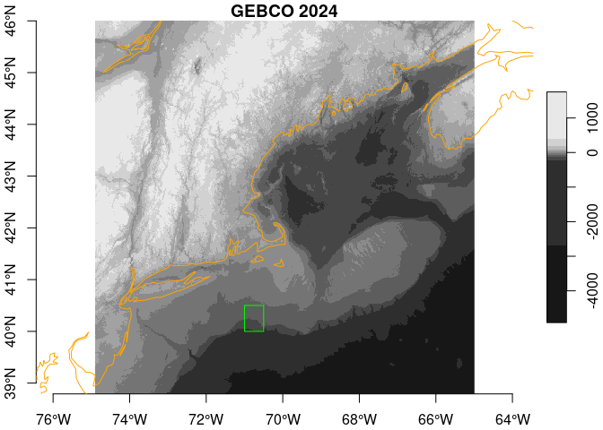
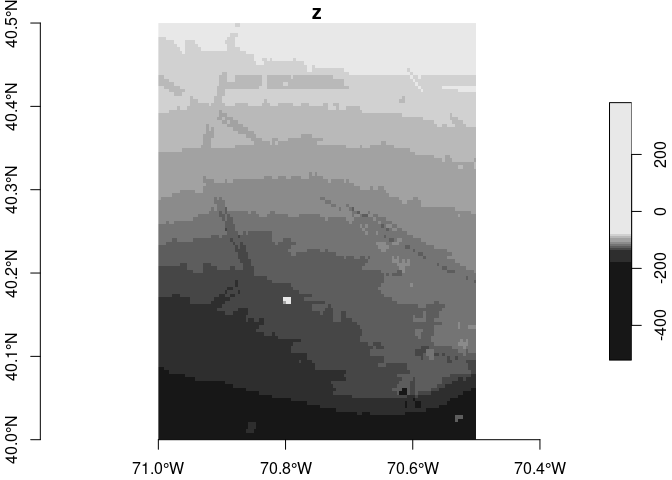

GEBCO_2024 issue
================

We have encountered a small patch of surprising values south of Long
Island, NY, USA. We downloaded the [GEBCO_2024 Grid (ice surface
elevation)](https://www.gebco.net/data_and_products/gridded_bathymetry_data/)
as zipped NetCDF, and then decompressed it.

Citation: GEBCO Compilation Group (2024) GEBCO 2024 Grid
(<doi:10.5285/1c44ce99-0a0d-5f4f-e063-7086abc0ea0f>)

``` r
suppressPackageStartupMessages({
  library(stars)
  library(sf)
  library(rnaturalearth)
  library(topotools)
  library(dplyr)
})

coast = rnaturalearth::ne_coastline(scale = "medium", returnclass = "sf")
BB = c(xmin = -74.9, xmax = -65, ymin = 38.8, ymax = 46)
gebco = topotools::read_gebco(bb = BB)
```

Next define a small study region where we have discovered a possible
issue.

``` r
bb = c(xmin = -71, ymin = 40, xmax = -70.5, ymax = 40.5) |>
  sf::st_bbox(crs = 4326) |>
  sf::st_as_sfc()
plot(gebco, axes = TRUE, reset = FALSE, main = "GEBCO 2024")
```

    ## downsample set to 2

``` r
plot(sf::st_geometry(coast), col = "orange", add = TRUE)
plot(bb, add = TRUE, border = "green")
```

<!-- -->

Below we zoom in on the region. We can see some linear interpolation
features, but the small cluster of white pixels are particularly
distinctive.

``` r
subset = gebco[bb]
plot(subset, axes = TRUE)
```

<!-- -->

And here are interpolated coordinates and elevations for pixels at or
above 0m.

``` r
x = as_tibble(subset) |>
  dplyr::filter(z >= 0) |>
  print()
```

    ## # A tibble: 3 × 3
    ##       x     y     z
    ##   <dbl> <dbl> <int>
    ## 1 -70.8  40.2    53
    ## 2 -70.8  40.2   382
    ## 3 -70.8  40.2    91
